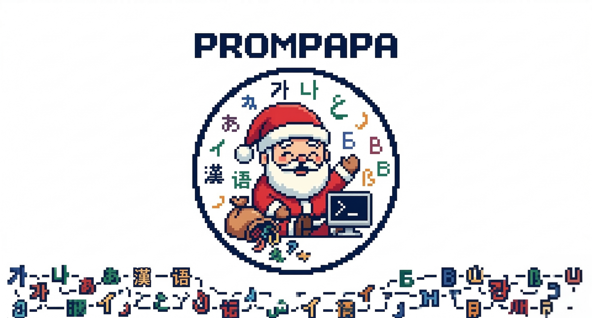
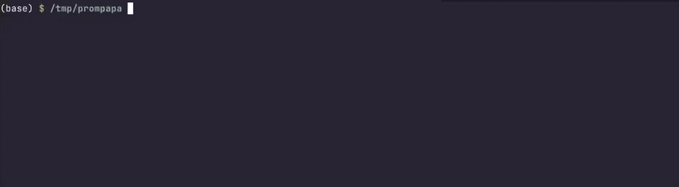
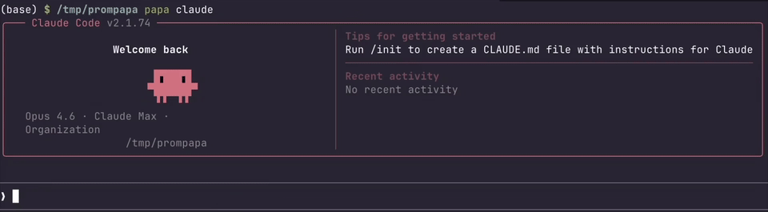
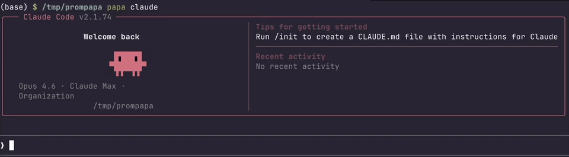
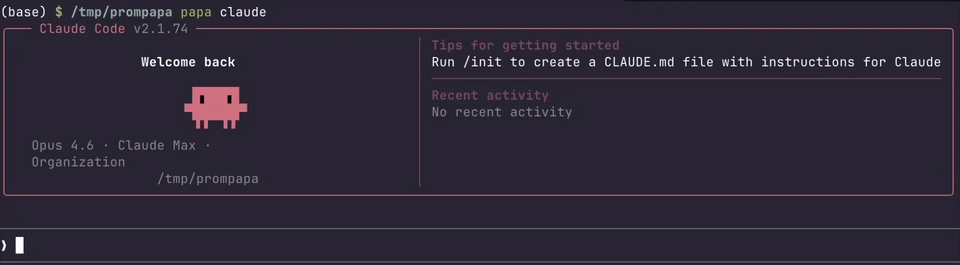
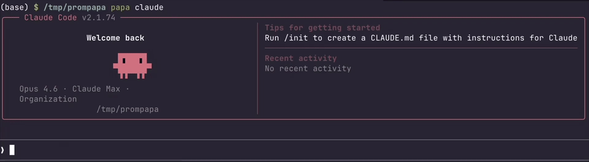

<p align="center">
  
</p>

<p align="center">
  <em>Tapez dans votre langue. Appuyez sur <code>Ctrl+]</code> dans <strong>Claude Code / Codex / Opencode</strong>. Regardez-le devenir un anglais parfait.</em>
</p>

<p align="center">
  
  
  
</p>

<p align="center">
  <a href="README.md">English</a> · <a href="README.ko.md">한국어</a> · <a href="README.ja.md">日本語</a> · <a href="README.zh.md">中文</a> · <a href="README.fr.md">Français</a> · <a href="README.es.md">Español</a> · <a href="README.de.md">Deutsch</a> · <a href="README.ru.md">Русский</a>
</p>

## Démonstration

<table>
  <tr>
    <td align="center">
      
      <br/>🇰🇷 Coréen
    </td>
    <td align="center">
      
      <br/>🇯🇵 Japonais
    </td>
    <td align="center">
      
      <br/>🇨🇳 Chinois
    </td>
  </tr>
  <tr>
    <td align="center">
      
      <br/>🇫🇷 Français
    </td>
    <td align="center">
      
      <br/>🇪🇸 Espagnol
    </td>
    <td align="center">
      
      <br/>🇩🇪 Allemand
    </td>
  </tr>
</table>

<p align="center"><em><strong>Tapez dans <em>n'importe quelle langue</em>. Appuyez sur <code>Ctrl+]</code> pour traduire en anglais. Appuyez sur <code>Ctrl+Q</code> pour annuler.</strong></em></p>

## Pourquoi cela existe

La langue n'est pas un contenant neutre pour la pensée. Les mots auxquels on pense en premier, la structure qu'on impose avant même de savoir ce qu'on veut dire, l'instinct qui précède l'articulation. Tout cela est natif. Forcer ce processus à travers une seconde langue ne fait pas que le ralentir. Cela le remodèle silencieusement.

Les assistants de codage IA portent une contrainte analogue depuis la direction opposée. La recherche confirme ce que beaucoup ont pressenti : ces modèles présentent un biais structurel envers l'anglais, où la même intention exprimée dans une langue non anglaise produit des réponses mesurables plus faibles [[1]](https://arxiv.org/abs/2504.11833). Le biais est plus profond que le vocabulaire de surface. Des analyses représentationnelles des grands modèles de raisonnement montrent que leurs chemins de raisonnement internes sont centrés sur l'anglais par architecture, pas seulement par les données d'entraînement. Quelle que soit la langue dans laquelle un prompt arrive, le modèle converge vers un espace latent de forme anglaise avant de commencer à raisonner [[2]](https://arxiv.org/abs/2601.02996). Séparer la représentation linguistique du substrat de raisonnement révèle le même schéma : le moteur de raisonnement fonctionne mieux quand la couche linguistique qui lui est présentée est l'anglais [[3]](https://arxiv.org/abs/2505.15257). La conséquence n'est pas théorique. Sur onze langues et quatre domaines de tâches, les prompts non anglais produisent une dégradation constante des performances et de la robustesse [[4]](https://arxiv.org/abs/2505.15935).

Deux esprits aux buts contradictoires. L'un pense le plus clairement dans sa langue maternelle. L'autre raisonne mieux en anglais.

Prompapa se tient entre eux. Rien de plus.

### Références

1. Gao et al. (2025). *Could Thinking Multilingually Empower LLM Reasoning?* [arXiv:2504.11833](https://arxiv.org/abs/2504.11833)
2. Liu et al. (2026). *Large Reasoning Models Are (Not Yet) Multilingual Latent Reasoners.* [arXiv:2601.02996](https://arxiv.org/abs/2601.02996)
3. Zhao et al. (2025). *When Less Language is More: Language-Reasoning Disentanglement Makes LLMs Better Multilingual Reasoners.* NeurIPS 2025. [arXiv:2505.15257](https://arxiv.org/abs/2505.15257)
4. Hofman et al. (2025). *MAPS: A Multilingual Benchmark for Agent Performance and Security.* EACL 2026. [arXiv:2505.15935](https://arxiv.org/abs/2505.15935)

## Installation

Nécessite [uv](https://docs.astral.sh/uv/). Si vous ne l'avez pas encore :

```bash
# macOS / Linux
curl -LsSf https://astral.sh/uv/install.sh | sh

# Windows (PowerShell)
powershell -ExecutionPolicy ByPass -c "irm https://astral.sh/uv/install.ps1 | iex"
```

Puis installez prompapa :

```bash
uv tool install git+https://github.com/seilk/prompapa
```

## Configuration initiale

Lancez l'assistant de configuration pour configurer votre clé API :

```bash
papa onboard
```

Cela configure `~/.config/prompapa/config.toml` avec votre clé API Google Cloud Translation.

### Obtenir une clé API Google Cloud Translation

> **Niveau gratuit :** Google Cloud Translation API (Basic) offre **500 000 caractères gratuits par mois**. Au-delà, c'est 20 $ par million de caractères. Un prompt IA typique fait 100 à 300 caractères, soit environ 1 500 à 5 000 traductions par jour dans la limite gratuite.

1. Rendez-vous sur [console.cloud.google.com](https://console.cloud.google.com) et connectez-vous.
2. Créez un nouveau projet ou sélectionnez-en un existant.
3. Allez dans **APIs & Services → Bibliothèque**, recherchez **Cloud Translation API** et cliquez sur **Activer**.
4. Il vous sera demandé d'activer la facturation. Une carte bancaire est requise, mais **vous ne serez pas facturé dans la limite gratuite**. ([Détails tarifaires](https://cloud.google.com/translate/pricing))
5. Allez dans **APIs & Services → Identifiants → Créer des identifiants → Clé API**.
6. Copiez la clé générée et collez-la lorsque `papa onboard` vous la demande.

## Utilisation

```bash
papa claude # for Claude-Code
papa codex # for Codex
papa opencode # for Opencode
```

Votre outil s'ouvre exactement comme d'habitude. Deux nouveaux raccourcis clavier :

| Raccourci | Action |
|--------|--------|
| `Ctrl+]` | Traduire la saisie actuelle en anglais |
| `Ctrl+Q` | Annuler la traduction, restaurer le texte original |

## Configuration

`~/.config/prompapa/config.toml` :

```toml
provider = "google"
api_key = "your-gcp-translation-api-key"
target_cmd = ["claude"]
preserve_backticks = true
```

`api_key_env` est également supporté si vous préférez garder la clé dans une variable d'environnement :

```toml
provider = "google"
api_key_env = "GOOGLE_API_KEY"
target_cmd = ["claude"]
```

### preserve_backticks

Garde les tokens entre guillemets obliques non traduits :

```toml
preserve_backticks = true
```

`` `src/auth.ts` `` reste exactement tel quel après la traduction.

## Comment ça fonctionne

Prompapa fork votre CLI cible dans un **PTY (pseudo-terminal)**, se positionnant de façon transparente entre votre clavier et le processus. Chaque frappe passe sans modification jusqu'à ce que vous appuyiez sur `Ctrl+]`.

À ce moment :

1. Lit la saisie actuelle depuis l'écran du terminal via un traqueur d'écran `pyte`
2. Lance un appel asynchrone à l'API Google Cloud Translation
3. Efface le texte original avec des retours arrière précisément comptés (sans actualisation d'écran)
4. Injecte le résultat en anglais via un collage entre parenthèses

Le processus enfant ne s'arrête jamais. L'interface ne se redessine jamais. Le texte... change, simplement.

## Développement

```bash
git clone https://github.com/seilk/prompapa
cd prompapa
uv sync
uv run pytest -v
```

Exécuter localement sans installation :

```bash
uv run papa claude
```

## Mise à jour

```bash
papa update
```

Récupère et réinstalle la dernière version depuis GitHub.

## Désinstallation

```bash
papa uninstall
```

Votre configuration dans `~/.config/prompapa/` est conservée. Supprimez-la manuellement si nécessaire.

## TODO
- [x] Support `codex` et `opencode`
- [ ] Support de traduction via LLM API (OpenAI, Gemini, Claude, ...)
- [ ] Langue cible (destination) configurable et élargie (actuellement anglais uniquement)
